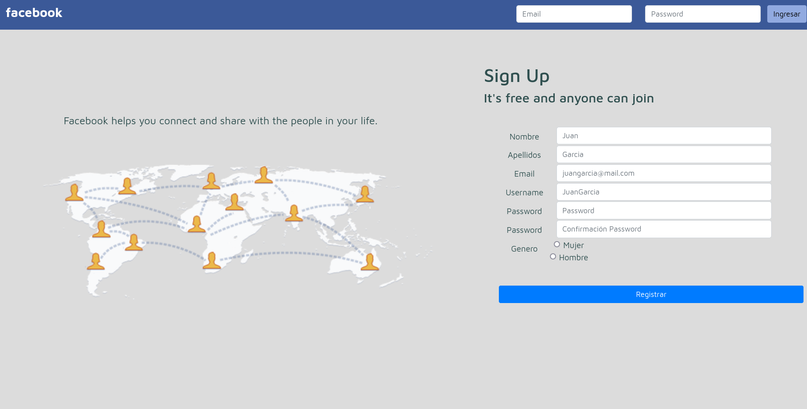
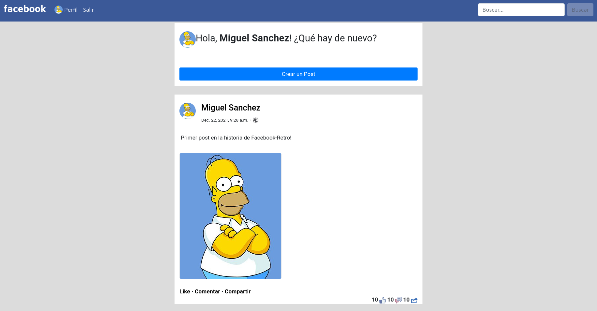
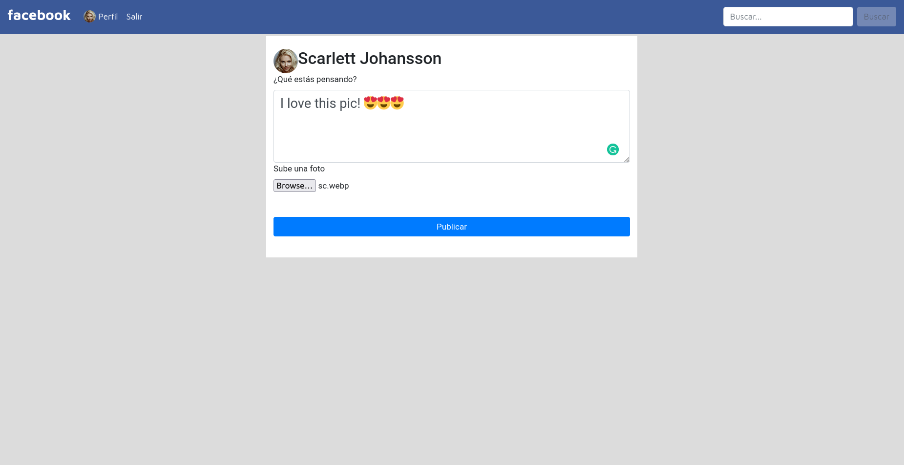
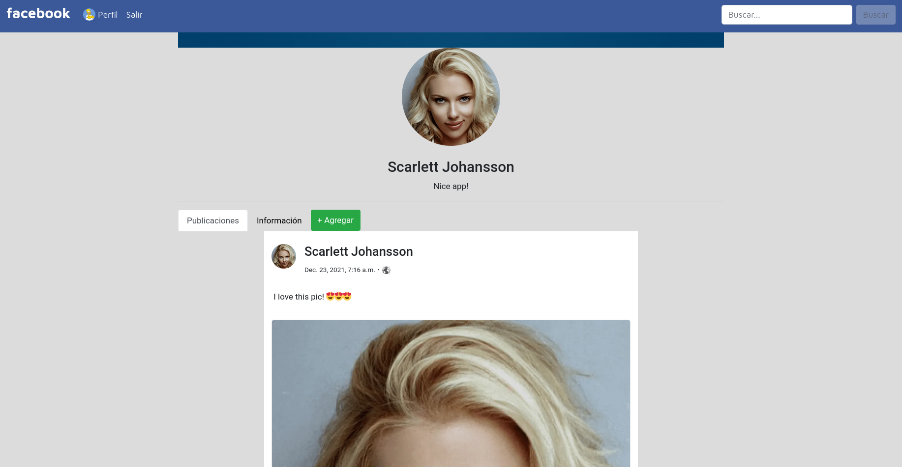
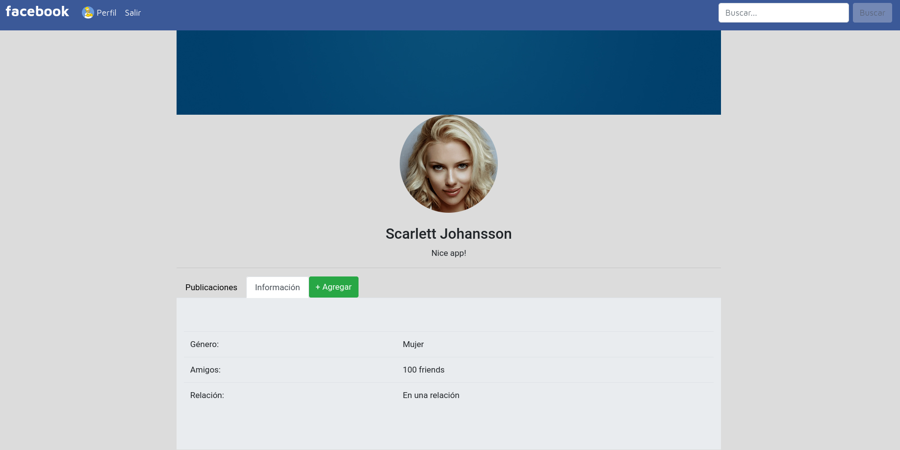
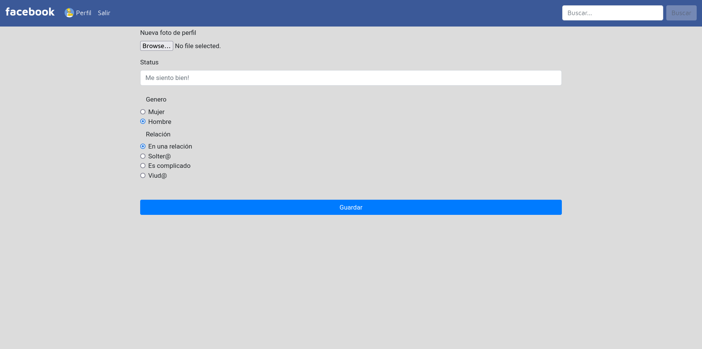

# FACEBOOK RETRO (PROJECT)

Facebook-Retro is a project based on Facebook, created by Miguel Sanchez ***@mkangelo_***.

The project was developed with *Python and Django.* You can access the project in this [link](http://facebookretro.facebook-retro.tk/login/).

>How does it work?

Facebook-Retro has a similar interface to Facebook (2013), where you can create an account and then access it with your credentials. 

When you are on the home page, will find the posts from other users, and you will be able to create a new post using the button "POST" 

The interface is simple, could select an image and put a description or thought, for then posted. 

If you click on the picture or name of a user, you will visit the profile of this person. You will be able to watch posts and information about him/her.

Finally, you can click on your profile section and will be able to modify your information like picture, status, relationship or sex.

This is Facebook-Retro, enjoy it. 